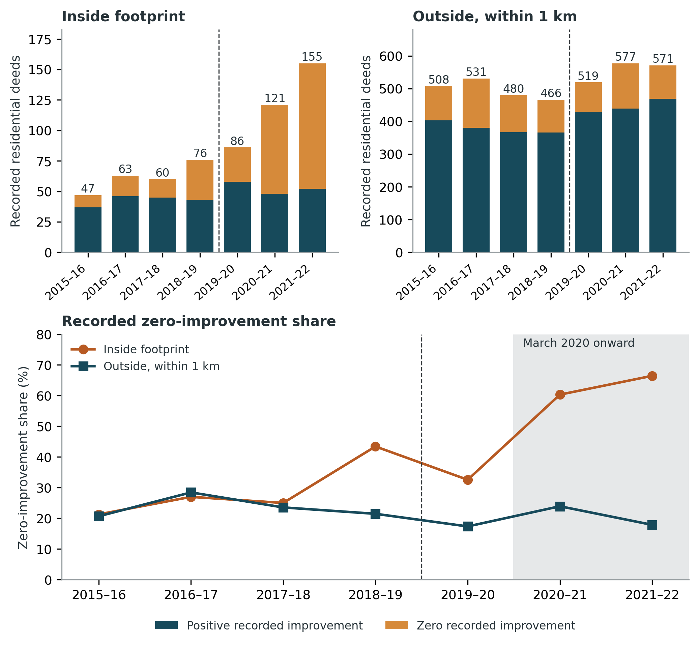

# Residential Transactions After the 2019 Nebraska Flood

This study examines recorded residential transaction composition and prices before and after the 2019 Nebraska flood. It follows deeds from 2015–2022 within an inherited flood footprint and surrounding comparison areas.

## Results and interpretation

Inside the inherited 2019 flood footprint, the share of retained deeds with zero recorded improvement value rises from **30.5% before the flood to 56.4% afterward**. The strongest descriptive shift occurs after March 2020.

The adjusted relative change is **+8.7 percentage points (95% CI −6.6 to +23.9)**. Adjusted pooled residential prices change by **+6.9% (−15.8% to +35.7%)**, and prices among positive-improvement deeds by **+3.4% (−19.4% to +32.6%)**. These wide intervals and timing sensitivities do not establish an immediate flood-induced change. A recorded zero-improvement value is not independent evidence of demolition or vacancy. See the [primary results](manuscript_quarto/data/flood_market_main_table.csv).

## Explore this repository

- [Research figures](manuscript_quarto/figures/)
- [Methods](docs/METHODS.md)
- [Reproduction and dependencies](docs/REPRODUCING.md)
- [Source guide](docs/CODE_MAP.md)
- [Data sources and availability](data/README.md)

## Reproduce the work

Start with the [reproduction guide](docs/REPRODUCING.md) for the entry point, inputs, software, and validation limits.

**Scope:** Scientific unit checks verified; deed-level data and ownership-model inputs remain external.

## Attribution and use

The associated study is “Residential Transaction Composition and Prices After the 2019 Nebraska Flood.” The analysis covers 2015–2022.

Maintained by [CECREH at Texas Tech University](https://www.depts.ttu.edu/cecreh/). Documentation reviewed September 6, 2026. Cite the repository version you used; see [citation guidance](CITATION.md).

No reuse license is specified for this repository. Contact CECREH about permissions; source-data terms apply separately.
